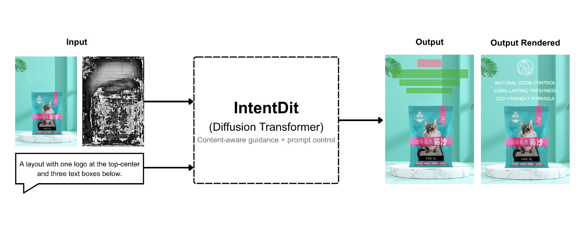

# IntentDiT

<div align="center">

### Prompt-Controllable Diffusion Transformer for Intent-Aware Poster Layout Generation

[Artifacts](https://drive.google.com/drive/folders/1TrXbdr_ItKoHe7GZIe4XWne9uy1S8-E2?usp=drive_link) |
[PKU PosterLayout](https://mipl.pku.edu.cn/PosterLayout/) |
[CGL Dataset](https://github.com/minzhouGithub/CGL-GAN) |
[Data Layout](docs/DATA.md) |
[Reproducibility](docs/REPRODUCIBILITY.md) |
[License](LICENSE)

</div>

[](paper/fig/fig01.pdf)

This repository contains the PyTorch implementation of IntentDiT, a
prompt-controllable diffusion transformer for content-aware poster layout
generation. IntentDiT uses image features, saliency guidance, a learned
placement-suitability prior, and optional BERT token conditioning to generate
poster layouts with controllable element classes, counts, and positions.

## Highlights

- Prompt control for element classes, counts, and coarse spatial positions.
- Content-aware conditioning with background image features, saliency maps, and
  learned placement-suitability maps.
- Numbered scripts for training, evaluation, prompt robustness, sampling
  efficiency, diversity, cross-dataset transfer, diagnostics, and user-study
  preparation.
- External artifact bundle for datasets, checkpoints, model weights, and
  generated evidence files.

## Updates

- Public source release with model code, experiment scripts, prompt tools,
  user-study utilities, and reproducibility documentation.
- Artifact bundle available through Google Drive.

## How to Run

### Prerequisites

Recommended environment:

```text
Python 3.9 or 3.10
CUDA-capable PyTorch installation
```

Install dependencies:

```bash
git clone git@github.com:aaghakr/layoutdit.git
cd layoutdit

conda create -n intentdit python=3.10 -y
conda activate intentdit
pip install -r requirements.txt
```

### Data Preparation

The experiments use two public content-aware poster-layout benchmarks:

- **PKU PosterLayout:** official project page
  [mipl.pku.edu.cn/PosterLayout](https://mipl.pku.edu.cn/PosterLayout/) and
  official repository
  [PKU-ICST-MIPL/PosterLayout-CVPR2023](https://github.com/PKU-ICST-MIPL/PosterLayout-CVPR2023).
- **CGL Dataset:** original CGL-GAN release
  [minzhouGithub/CGL-GAN](https://github.com/minzhouGithub/CGL-GAN), which links
  to the Tianchi dataset page.

The processed files used by this repository, including checkpoints, derived
maps, generated evidence files, and custom prompt data, are provided in the
artifact bundle:

```text
https://drive.google.com/drive/folders/1TrXbdr_ItKoHe7GZIe4XWne9uy1S8-E2?usp=drive_link
```

Place the downloaded files according to [docs/DATA.md](docs/DATA.md).

Our custom prompt data extends the original layout annotations with language
instructions for controllability evaluation. It includes deterministic
annotation-derived prompt families and independently authored free-form prompts.
The free-form prompts were written by human prompt authors using the prompt app
without viewing ground-truth layout boxes, and are stored as
`prompt_app/free_form_pku.csv` and `prompt_app/free_form_cgl.csv`.

Validate the checkout:

```bash
cd code
python -m unittest discover -s tests -v
```

### Training

```bash
cd code
python scripts/train.py \
  --dataset pku \
  --task uncond \
  --v_encoder vit \
  --spatial_guidance 2 \
  --text_control \
  --seed 1 \
  --experiment_name pku_vit_both_text_seed1
```

### Evaluation

```bash
cd code
python scripts/test.py \
  --dataset pku \
  --anno anno \
  --task uncond \
  --v_encoder vit \
  --spatial_guidance 2 \
  --text_control \
  --seed 1 \
  --check_path /path/to/Epoch500_cgbdm_weights.pth \
  --experiment_name pku_vit_both_text_seed1
```

Use `--path-profile server` only for the lab-server path profile. Local
execution resolves paths from the current checkout.

## Repository Structure

```text
code/           Core model, data pipeline, training, evaluation, and tests
intent_detect/  Placement-suitability predictor
scripts/paper/  Numbered experiment pipeline
prompt_app/     Free-form prompt authoring app
user_study/     Human-evaluation web app and aggregation tools
docs/           Data and reproducibility documentation
paper/fig/      Public figures used by the repository documentation
data/           Local data and weights populated from the artifact bundle
experiments/    Generated results populated from runs or the artifact bundle
```

## Experiment Pipeline

The complete executable pipeline is documented in
[scripts/paper/README.md](scripts/paper/README.md).

Common entry points:

```bash
bash scripts/paper/01_validate_environment.sh
bash scripts/paper/02_train_paper_models.sh
bash scripts/paper/05_evaluate_paper_models.sh
bash scripts/paper/06_aggregate_paper_results.sh
```

See [docs/REPRODUCIBILITY.md](docs/REPRODUCIBILITY.md) for reporting rules,
provenance requirements, and evaluation guardrails.

## Citation

If this repository is useful for your research, please cite the associated
paper. The citation metadata is provided in [CITATION.cff](CITATION.cff).

## Contact

For questions or further information, please open an issue in this repository.

## License

This repository is released under the [Apache-2.0 license](LICENSE).
